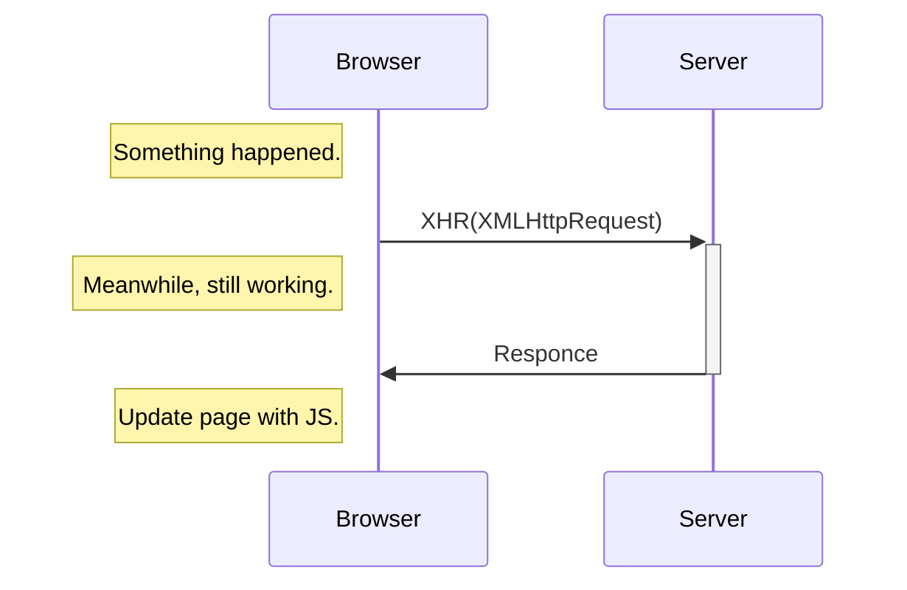

最近计划把我去年上半年的`Hand-Written-HTML-Site`拿出来讲一讲，展示一下我研究`JavaScript`的成果。在写的过程中我用到了`jQuery`，这里先转一篇入门的教程过来，后面如果有需要的话可以来这里查阅。

原文链接、参考资料：

1. [jQuery入门 - 知乎](https://zhuanlan.zhihu.com/p/538115881)

2. [jQuery入门教程_小宇爱吃辣条的博客-CSDN博客_jquery教程](https://blog.csdn.net/hy250_/article/details/124813755)

3. [JQuery中Ajax的简单操作_低头只管敲的博客-CSDN博客_jquery ajax](https://blog.csdn.net/weixin_51094637/article/details/124490662)

<!--more-->

## 1. 使用`jQuery`

`jQuery`是一个快速、简洁的`JavaScript`框架，于2006年1月由John Resig发布。`jQuery`设计的宗旨是`Write Less，Do More`，即倡导写更少的代码，做更多的事情。它封装`JavaScript`常用的功能代码，提供一种简便的`JavaScript`设计模式，优化`HTML`文档操作、事件处理、动画设计和`Ajax`交互。

一般为了获取最新的`jQuery`，我们使用`CDN`，例如：

```html
<script src="https://cdn.jsdelivr.net/npm/jquery@3/dist/jquery.min.js"></script>
```

****

## 2. `jQuery`元素选择器

### 2.1 元素选择器

`jQuery`使用`CSS`选择器来选取`HTML`元素：

1. `$("p")` 选取 `<p>` 元素

2. `$("p.intro")` 选取所有`class=intro`的`<p>`元素

3. `$("p#demo")`选取所有`id="demo"`的`<p>`元素

### 2.2 属性选择器

1. `$("[href]")` 选取所有带有`href`属性的元素

2. `$("[href='#']")` 选取所有带有`href`值等于`#`的元素

3. `$("[href!='#']")` 选取所有带有`href`值不等于`#`的元素

4. `$("[href$='.jpg']")` 选取所有`href`值以`.jpg`结尾的元素

### 2.3 更多例子

1. `$("p.intro.demo")`选取所有`class=intro`同时`class=demo`的`<p>`元素

2. `$(this)`选取`JavaScript`中当前元素

3. `$("*")`选取所有元素

4. `$("p,i,a")`选取所有`<p>`、`<i>`和`<a>`

### 2.4 层次选择器

1. `$("p a")`选择所有`<p>`中的`<a>`

2. `$("div.demo > div")`选择`<div class="demo">`中的`<div>`，不包括这些`<div>`的子代`<div>`

3. `$("span.code + button.copy")`选择`<span class="code">`后最相邻的`<button class="copy">`

4. `$("span#demo ~ img")`选择`<span id="demo">`后所有``

### 2.5 过滤选择器

#### 2.5.1 基本过滤

| **选择器**      | **描述**                        | **示例**                                            |
|:------------:|:-----------------------------:|:-------------------------------------------------:|
| `:first`     | 选择第1个元素                       | `$("div:first")`选择第1个`div`元素                      |
| `:last`      | 选择最后1个元素                      | `$("div:last")`选择最后1个`div`元素                      |
| `:not(E1)`   | 去除所有`E1`选择器匹配的元素              | `$("input:not(.my)")`选择`class`不是`.my`的所有`input`元素 |
| `:even`      | 选择索引是偶数的所有元素，索引从0开始           | `$("tr:even")`选择表格中所有偶数的行                         |
| `:odd`       | 选择索引是奇数的所有元素，索引从0开始           | `$("tr:odd")`选择表格中所有奇数的行                          |
| `:eq(index)` | 选择索引值是`index`的元素，`index`从0开始  | `$("tr:eq(1)")`选择表格行索引等于1的行                       |
| `:gt(index)` | 选择索引值大于`index`的元素，`index`从0开始 | `$("tr:gt(1)")`选择表格行索引大于1的行                       |
| `:lt(index)` | 选择索引值小于`index`的元素，`index`从0开始 | `$("tr:lt(1)")`选择表格行索引小于1的行                       |
| `:header`    | 所取所有的标题元素                     | `$(":header")`选择网页中所有的`<h1>~<h6>`                 |
| `:animated`  | 选择当前正在执行动画的所有元素               | `$("div:animated")`选择正在执行动画的`div`元素               |

#### 2.5.2 内容过滤

| **选择器**           | **描述**                   | **示例**                                   |
|:-----------------:|:------------------------:|:----------------------------------------:|
| `:contains(text)` | 选择含有`text`文本内容的元素        | `$("div:contains('我')")`选择内容里包含我的所有`div` |
| `:empty`          | 选择不包含子元素或文本的空元素          | `$("div:empty")`选择不包含子元素（含文本）的所有`div`元素  |
| `:has(E1)`        | 选择包含有(`E1`选择器匹配的元素)的所有元素 | `$("div:has(p)")`选择含有`p`元素的所有`div`元素     |
| `:parent`         | 选择含有子元素或文本的元素            | `$("div:parent")`选择拥有子元素（包含文本）的所有`div`元素 |

#### 2.5.3 子元素过滤

| **选择器**                      | **功能描述**                                       | **简单示例**                                                                                                           |
| ---------------------------- | ---------------------------------------------- | ------------------------------------------------------------------------------------------------------------------ |
| `:nth-child(index/even/odd)` | 选取每个父元素下的第`index`个子元素或奇偶元素.(`index`从1开始）       | `:eq(index)`只匹配一个元素,而`:nth-child(index)`将为每一个父元素匹配子元素,并且`:nth-child(index)`的`index`从1开始,而`:eq(index)`的`index`从0开始. |
| `:first-child`               | 选择每个父元素的第1个子元素                                 | `:first`只选择单个元素,而`:first-child`将为每个父元素匹配第1个子元素如:`$(“ul li:first-child”)`选择每个`<ul>`下的第一个`<li>`                      |
| `:last-child`                | 选取每个父元素的最后1个子元素                                | `$(“ul li:last-child”)`选择每个`<ul>`下的最后一个`<li>`                                                                      |
| `:only-child`                | 如果某个元素是它父元素中惟一的子元素,那么将会被匹配.如果父元素中含有其他元素,则不会被匹配 | `$(“ul li:only-child”)`在中选取是惟一子元素的`<li>`                                                                           |

> `:nth-child()`选择器详细功能描述:
> 
> - `:nth-child(even)`能选择每个父元素下的索引值是偶数的元素
> 
> - `:nth-child(odd)`选择出每个父元素下的索引值是奇数的元素
> 
> - `:nth-child(2)`选取每个父元素下的索引值等于2的元素 
> 
> - `:nth-child(3n)`能选出每个父元素下的索引值是3的倍数的元素,n从0开始
> 
> - `:nth-child(3n+1)`能选取每个父元素下的索引值是3n+1的元素.n从0开始

****

## 3. `jQuery`事件

页面对不同访问者的响应叫做事件，事件处理程序指的是当`HTML`中发生某些事件时所调用的方法

页面中指定一个点击事件对应：

```js
$("p").click(function(){
    alert('Click')
});
```

其它的事件还有：

- 鼠标事件：`click`、`dblclick`、`mouseenter`、`mouseleave`、`hover`

- 键盘事件：`keypress`、`keydown`、`keyup`

- 表单事件：`submit`、`change`、`focus`、`blur`

- 文档、窗口事件：`load`、`resize`、`scroll`、`unload`

这里面有一个入口函数`$(document).ready()`，简称`$()`。`$(document).ready()`与`window.οnlοad=function(){}`的区别:

|      | `window.onload`                | `$(document).ready()`          |
| ---- | ------------------------------ | ------------------------------ |
| 执行时机 | 必须等待网页全部加载完毕（包括 图片等），然后再执行包裹代码 | 只需要等待网页中的`DOM`结构加载完毕，就能执行包裹的代码 |
| 执行次数 | 只能执行一次，如果第二次，那么 第一次的执行会被覆盖     | 可以执行多次，第N次都不会被上 一次覆盖           |

****

## 4. `jQuery`操作元素动画

### 4.1 显示隐藏

可以使用`hide()`和`show()`方法来隐藏和显示`HTML`元素：

```js
$("button").click(function(){
  $("p").hide();
});

$("button").click(function(){
  $("p").show();
});
```

语法：

```js
//speed  规定隐藏/显示的速度
//callback  隐藏或显示完成后所执行的函数

$(selector).hide(speed,callback);

$(selector).show(speed,callback);
```

可以使用`toggle()`方法来切换`hide()`和`show()`方法：

```js
$("button").click(function(){
  $("p").toggle();
});
// 语法
// $(selector).toggle(speed,callback);
```

### 4.2 淡入淡出

通过`fade`，可以实现元素的淡入淡出效果。四种`fade`方法，都可接收2个参数：

1. `speed`：规定效果的时长
2. `callback`：完成后所执行的函数

`fadeIn()`用于淡入已隐藏的元素:

```js
$("button").click(function(){
  $("#div1").fadeIn();
  $("#div3").fadeIn(3000);
});
```

`fadeOut()`方法用于淡出可见元素：

```js
$("button").click(function(){
  $("#div1").fadeOut();
  $("#div3").fadeOut(3000);
});
```

`fadeToggle()`方法可以在`fadeIn()`与`fadeOut()`方法之间进行切换，如果元素已淡出，则`fadeToggle()`会向元素添加淡入效果；如果元素已淡入，则`fadeToggle()`会向元素添加淡出效果：

```js
$("button").click(function(){
  $("#div1").fadeOut();
  $("#div3").fadeOut(3000);
});
```

`fadeTo()`方法允许渐变为给定的不透明度（值介于 0 与 1 之间）：

```js
$("button").click(function(){
  $("#div3").fadeTo(3000,0.3);
  $("#div3").fadeTo(3000,0.5);
  $("#div3").fadeTo(3000,0.7);
});
```

### 4.3 滑动

通过`slide`，可以实现元素的滑入滑出效果。三种`slide`方法，都可接收2个参数：

1. `speed`：规定效果的时长
2. `callback`：完成后所执行的函数

`slideDown()`方法用于向下滑动元素：

```js
$("button").click(function(){
  $("#div1").slideDown();
});
```

`slideUp()`方法用于向上滑动元素：

```js
$("button").click(function(){
  $("#div1").slideUp();
});
```

`slideToggle()`方法可以在`slideDown()`与`slideUp()`方法之间进行切换。如果元素向下滑动，则`slideToggle()`可向上滑动它们；如果元素向上滑动，则`slideToggle()`可向下滑动它们：

```js
$("button").click(function(){
  $("#divl").slideToggle();
});
```

### 4.4 自定义动画

`animate()`方法用于创建自定义动画。

默认所有 HTML 元素都有一个静态位置，且无法移动。如需对位置进行操作，首先把元素的`CSS position`属性设置为`relative`、`fixed`或`absolute`才可。

```js
//必需的 params 参数定义形成动画的 CSS 属性。

//可选的 speed 参数规定效果的时长。它可以取以下值："slow"、"fast" 或毫秒。

//可选的 callback 参数是动画完成后所执行的函数名称

$(selector).animate({params},speed,callback);
```

```js
$("button").click(function(){
  $("div").animate({left:'250px'});
});
```

同时操作多个属性：

```js
$("button").click(function(){
  $("div").animate({
    left:'250px',
    opacity:'0.5',
    height:'150px',
    width:'150px'
  });
});
```

`animate()`方法可以用来操作大部分`CSS`属性。当使用`animate()`时，必须使用驼峰写所有的属性名，比如，必须使用`paddingLeft`而不是`padding-left`，使用`marginRight`而不是`margin-right`。

也可以定义相对值（该值相对于元素的当前值）。需要在值的前面加上`+=`或`-=`：

```js
$("button").click(function(){
  $("div").animate({
    left:'250px',
    height:'+=150px',
    width:'+=150px'
  });
});
```

### 4.5 停止所有动画

`stop()`方法用于停止还在执行的动画或效果，适用于所有`jQuery`效果函数，包括滑动、淡入淡出和自定义动画：

```js
//$(selector).stop(stopAll,goToEnd);

$("#stop").click(function(){
  $("#panel").stop();
});
```

****

## 5. `jQuery`操作`DOM`

### 5.1 获取、改变元素内容

- `text()`：设置或返回所选元素的文本内容

- `html()`：设置或返回所选元素的内容（包括 HTML 标记）

- `val()`：设置或返回表单字段的值

获取内容：

```js
$("#btn1").click(function(){
  alert("Text: " + $("#test").text());
});
$("#btn2").click(function(){
  alert("HTML: " + $("#test").html());
});
```

```js
$("#btn1").click(function(){
  alert("Value: " + $("#test").val());
});
```

改变内容：

```js
$("#btn1").click(function(){
  $("#test1").text("Hello world!");
});
$("#btn2").click(function(){
  $("#test2").html("<b>Hello world!</b>");
});
$("#btn3").click(function(){
  $("#test3").val("Hello world");
});
```

### 5.2 获取、设置元素属性

`attr()`方法用于获取、设置属性值：

```js
$("button").click(function(){
  alert($("a").attr("href"));
});
```

```js
$("button").click(function(){
  $("a").attr("href","https://www.baidu.com/");
});

//设置多个属性
$("button").click(function(){
  $("a").attr({
      href :"https://www.baidu.com/",
      title : "百度"
  });
});
```

### 5.3 添加、删除元素

`append()`方法在被选元素的结尾插入内容：

```js
$("p").append("我是使用append插入的内容");
```

`prepend()`方法在被选元素的开头插入内容：

```js
$("p").prepend("我是使用prepend插入的内容");
```

`after()`方法在被选元素之后插入内容：

```js
$("p").after("我是使用after插入的内容");
```

`before()`方法在被选元素之前插入内容：

```js
$("p").before("我是使用before插入的内容");
```

`remove()`方法删除被选元素及其子元素：

```js
$("#div1").remove();
```

`remove()`方法也可接受一个参数，允许对被删元素进行过滤

```js
$("p").remove(".text");
```

`empty()`方法删除被选元素的子元素：

```js
$("#div1").empty();
```

### 5.4 操作`CSS`

`addClass()`方法向元素添加`class`属性：

```js
$("button").click(function(){
    // list red
  $("h1,h2,p").addClass("red");
  $("div").addClass("box");
});
```

也可以在`addClass()`方法中规定多个类：

```js
$("button").click(function(){
  $("#div1").addClass("box blue");
});
```

`removeClass()`删除指定的`class`属性：

```js
$("button").click(function(){
  $("h1,h2,p").removeClass("red");
});
```

`toggleClass()`对被选元素进行添加/删除类的切换操作：

```js
$("button").click(function(){
  $("h1,h2,p").toggleClass("red");
});
```

`css()`方法设置或返回被选元素的一个或多个样式属性：

```js
//获取样式
$("p").css();
//获取背景颜色
$("p").css("background-color");

//设置样式
$("p").css("background-color","yellow");
//设置多个样式
$("p").css({"background-color":"yellow","font-size":"200%"});
```

### 5.5 获取尺寸

`width()`方法设置或返回元素的宽度（不包括`padding`、`border`、`margin`），`height()`方法设置或返回元素的高度（不包括`padding`、`border`、`margin`）：

```js
$("button").click(function(){
    console.log($("#div1").width())
    console.log($("#div1").height())
});
```

`innerWidth()`方法返回元素的宽度（包括`padding`），`innerHeight()`方法返回元素的高度（包括`padding`）：

```js
$("button").click(function(){
    console.log($("#div1").innerWidth())
    console.log($("#div1").innerHeight())
});
```

`outerWidth()`方法返回元素的宽度（包括`padding`和`border`），`outerHeight()`方法返回元素的高度（包括`padding`和`border`）：

```js
$("button").click(function(){
    console.log($("#div1").outerWidth())
    console.log($("#div1").outerHeight())
});
```

`outerWidth(true)`方法返回元素的宽度（包括`padding`、`border`、`margin`），`outerHeight(true)`方法返回元素的高度（包括`padding`、`border`、`margin`）

```js
$("button").click(function(){
    console.log($("#div1").outerWidth(true))
    console.log($("#div1").outerHeight(true))
});
```

`width()`和`height()`方法也可用于指定元素宽度高度：

```js
$("button").click(function(){
  $("#div1").width(500).height(500);
});
```

****

## 6. `jQuery`元素遍历

### 6.1 向上遍历`DOM`树

`parent()`方法返回被选元素的直接父元素，该方法只会向上一级对`DOM`树进行遍历：

```js
$("span").parent().css({"color":"red","border":"2px solid red"}
```

`parents()`方法返回被选元素的所有祖先元素，它一路向上直到文档的根元素 （`<html>`）：

```js
$("span").parents().css({"color":"red","border":"2px solid red"}
```

`parentsUntil()`方法返回介于两个给定元素之间的所有祖先元素：

```js
$("span").parentsUntil("div").css({"color":"red","border":"2px solid red"});
```

### 6.2 向下遍历`DOM`树

`children()`方法返回被选元素的所有直接子元素：

```js
$("div").children().css({"color":"red","border":"2px solid red"});
//过滤对子元素
$("div").children("p.1").css({"color":"red","border":"2px solid red"});
```

`find()`方法返回被选元素的后代元素，一路向下直到最后一个后代：

```js
//只选中span
$("div").find("span").css({"color":"red","border":"2px solid red"});
//选中所有
$("div").find("*").css({"color":"red","border":"2px solid red"});
```

### 6.3 `DOM`树中水平遍历

`siblings()`方法返回被选元素的所有同胞元素：

```js
$("h2").siblings().css({"color":"red","border":"2px solid red"});
// <h2> 的同胞元素的所有 <p> 元素
$("h2").siblings("p").css({"color":"red","border":"2px solid red"});
```

`next()`方法返回被选元素的下一个同胞元素：

```js
$("h2").next().css({"color":"red","border":"2px solid red"});
```

`nextAll()`方法返回被选元素的所有跟随的同胞元素：

```js
$("h2").nextAll().css({"color":"red","border":"2px solid red"});
```

`nextUntil()`方法返回介于两个给定参数之间的所有跟随的同胞元素：

```js
 $("h2").nextUntil("h6").css({"color":"red","border":"2px solid red"});
```

同理，`prev()`获得匹配元素集合中每个元素紧邻的前一个同胞元素；`prevAll()`获得当前匹配元素集合中每个元素的前面的同胞元素；`prevUntil()`方法获得当前匹配元素集合中每个元素的前面的同胞元素。

### 6.4 遍历中的过滤

`first()`方法返回被选元素的首个元素：

```js
$("div p").first().css("background-color","yellow")
```

`last()`方法返回被选元素的最后一个元素：

```js
$("div p").last().css("background-color","yellow")
```

`eq()`方法返回被选元素中带有指定索引号的元素：

```js
$("p").eq(1).css("background-color","yellow")
```

`filter()`方法允许您规定一个标准,匹配的元素会被返回：

```js
$("p").filter(".info").css("background-color","yellow")
```

`not()`方法返回不匹配标准的所有元素：

```js
$("p").not(".info").css("background-color","yellow")
```

****

## 7. `jQuery`中的`Ajax`操作

### 7.1 `Ajax`是什么？

全称：`ASynchronous JavaScript And XML` （代表 异步`JavaScript`和`XML`)

`Ajax`并不是编程语言，是一种用于创建快速动态网页的技术。

`Ajax`组合了：浏览器内建的`XMLHttpRequest`对象（从`web` 服务器请求数据）、`JavaScript`和`HTML DOM`（显示或使用数据）

`Ajax`是一种在无需重新加载整个网页的情况下，能够更新部分网页的技术。 

通过在后台与服务器进行少量数据交换，`Ajax`可以使网页实现异步更新。这意味着可以在不重新加载整个网页的情况下，对网页的某部分进行更新。传统的网页（不使用`Ajax`）如果需要更新内容，必须重载整个网页页面。

同步与异步的区别在于，当用户发送同步请求时，当前页面不可以使用，服务器响应页面到客户端，响应完成，用户才可以使用页面；但当用户发送异步请求时，当前页面还可以继续使用，当异步请求的数据响应给页面，页面把数据显示出来。



### 7.2 `jQuery`中`Ajax`函数

通过`jQuery AJAX`方法，可以使用`HTTP`的`get`和`post`方法， 从远程服务器上请求文本、`HTML`、`XML`或`JSON`，同时还能够把这些外部数据直接载入网页的被选元素中。

`load()`方法从服务器加载数据，并把返回的数据放入被选元素中，

```js
$(selector).load(URL,data,callback);

//URL 参数规定加载的 URL 必选

//data 参数规定与请求一同发送的查询字符串键/值对集合 可选

//callback 参数是 load() 方法完成后所执行的函数名称 可选

 $("#btn1").click(function(){
     $('#test').load('/foo/bar',data,function(){});
 })
```

`$.get()`方法通过`HTTP GET`请求从服务器上请求数据。

```js
//$.get(URL,callback);

$("button").click(function(){
  $.get('/foo/bar',function(data,status){
    console.log(data);
    console.log(status);
  });
});
```

`$.post()`方法通过`HTTP POST`请求从服务器上请求数据。

```js
//$.post(URL,data,callback);

$.post("/foo/bar/demo_test_post.asp",
    {
      page:1,
      name:"Tina"
    },
    function(data,status){
      console.log(data);
      console.log(status);
    });
```

***

**THE END**感谢您的阅读\~
