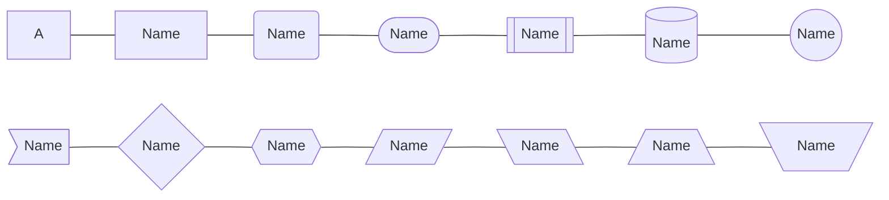
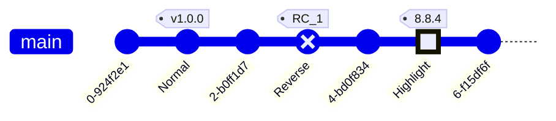

我在很久很久以前，似乎给这篇文章发过预告（似乎还是在那篇`Markdown`语法里面，前年发的了），那我决定把这个坑给填了。


项目官网：[Mermaid](https://mermaid.js.org/)

**如果你想要在`Hexo+Next`中渲染`Mermaid`图表，请参见本文最后一章。**

<!--more-->

## 1. 流程图

刚刚你已经看到了一个流程图了。可以看出，一个流程图分三部分：**方向、节点和连线**，每一个属性都可以自定义。

### 1.1 方向

每一个`Markdown`编辑器的语法可能略有差别，这里我拿通用的`Mermaid`的官方语法来讲。首先，每个图表都要用

<div class="highlight-container">
  <figure class="highlight md">
    <div class="table-container">
      <table>
        <tbody>
          <tr>
            <td class="gutter">
              <pre><span class="line">1</span>
<span class-"line">2</span>
<span class="line">3</span></pre>
            </td>
            <td class="code">
              <pre><span class="line">``mermaid</span>
<span class="line">graph</span>
<span class="line">``</span></pre>
            </td>
          </tr>
        </tbody>
      </table>
    </div>
  </figure>
  <div class="copy-btn"><i class="fa fa-clipboard fa-fw"></i></div>
</div>

来标记。下文为了方便，就都不写出来了。

**注：为了不让`Mermaid`渲染，我在上面少打了一个\`，需要自己补齐**

方向有以下四种：

- `LR`：`Left-Right`左→右

- `RL`：`Right-Left`右→左

- `TB`：`Top-Bottom`上→下

- `BT`：`Botton-Top`下→上

每个流程图的第一行就要标记方向：

```markdown
graph LR/RL/TB/BT
```

然后`Mermaid`没有那么高级，不支持即左到右，又上到下的复杂图。

### 1.2 节点

`Mermaid`中使用不同的括号标记节点形状：

| 样式      | 代码          | 样式     | 代码            |
|:-------:|:-----------:|:------:|:-------------:|
| 默认      | `A`         | 菱形     | `I{Name}`     |
| 方框      | `B[Name]`   | 长条六边形  | `J{{Name}}`   |
| 圆角矩形    | `C(Name)`   | 平行四边形  | `K[/Name/]`   |
| 胶囊      | `D([Name])` | 反平行四边形 | `L[\Name\]`   |
| 子方框     | `E[[Name]]` | 梯形     | `M[/Name\]`   |
| 圆柱（数据库） | `F[(Name)]` | 反梯形    | `N[\Name/]`   |
| 圆       | `G((Name))` | 子圆框    | `O(((Name)))` |
| 旗子      | `H>Name]`   | ↑      | 子圆框、六边形可能不受支持 |



我个人觉得还是很形象的，尤其是四边形这一块。那个`J{{Name}}`在本地渲染的出来，可是在线上就没了，不知道为什么。

### 1.3 连线

在`Mermaid`中，共有3种线型、4种箭头，你可以选择箭头的单、双向，并在连线上添加文本。这么一算，就是48种线型（当然这也取决于你使用的编辑器和`Mermaid`版本）。中间部分的长度可以调节连线的长度。这里就不一一给大家展示了。


| 线型  | 代码    | 箭头  | 代码    | 效果   | 代码             |
|:---:|:-----:|:---:|:-----:|:----:|:--------------:|
| 实线  | `---` | 三角  | `-->` | 两边箭头 | `<-->`等        |
| 粗实线 | `===` | 圆形  | `--o` | 文本   | `-- Text ---`等 |
| 虚线  | `-.-` | 叉号  | `--x` | 加长线条 | `----`等        |

### 1.4 子图

子图的意思是把一个完整的图分为很多小部分，然后互相有联系，基本的语法是：

```markdown
subgraph title
    graph definition
end
```

举个例子：


### 1.5 最终效果

最后给一个完整的例子：

```markdown
graph LR
    A[Hard edge] -->|Link text| B(Round edge)
    B --> C{Decision}
    C -->|One| D[Result one]
    C -->|Two| E[Result two]
```


```markdown
graph LR
    A[Start] --> B{Is it?}
    B -- Yes --> C[OK]
    C --> D[Rethink]
    D --> B
    B -- No ----> E[End]
```


***

## 2. 时序图（`Sequence`）

可能大家见过这样一组对话：


这种展现对话的方法叫做时序图，`sequence diagram`。主要特征，就是多个参与者`participant`和会话内容分别平行。

### 2.1 基础语法

```markdown
sequenceDiagram
    participant Alice
    participant Bob
    Alice->>Bob: Hi Bob
    Bob->>Alice: Hi Alice
```

首先`sequenceDiagram`标志这是时序图。然后我们要规定这张图里边有哪些参与者`participant`，这里则是Alice和Bob。最后就可以加入对话了。

#### 2.1.1 `participant`和`actor`

默认情况下使用`participant`命令会把人名用一个方框框起来，如果你不想这样的话，可以试试`actor`命令：


其次就是一个简写，如果你觉得人名过长的话，可以使用简写`alias`：

```markdown
sequenceDiagram
    participant A as Alice
    participant J as John
    A->>J: Hello John, how are you?
    J->>A: Great!
```


这样多个字符的人名就可以简化为一个。

#### 2.1.2 线型

时序图的线型会比流程图简单一点，只有8种：

| 线型       | 代码     |
|:--------:|:------:|
| 实线       | `->`   |
| 带箭头的实线   | `->>`  |
| 虚线       | `-->`  |
| 带箭头的虚线   | `-->>` |
| 带`x`的实线  | `-x`   |
| 带`x`的虚线  | `--x`  |
| 带圆角箭头的实线 | `-)`   |
| 带圆角箭头的虚线 | `--)`  |


```markdown
sequenceDiagram
    actor A as Alice
    actor B as Bob
    A->B: Hello!
    B->>A: Hi!
    A-->B: How are you today?
    B-->>A: Fine, thx, and you?
    A-xB: I'm great!
    B--xA: Want to go to the movies?
    A-)B: Of course!
    B--)A: Let's go!
```

### 2.2 标志会话范围

在谈话过程中可能会发生话题的转移。这里有两种方式来标志话题的范围：

#### 2.2.1 `(de)activate`

`activate`命令可以这么写：

```markdown
sequenceDiagram
    Alice->>John: Hello John, how are you?
    activate John
    John-->>Alice: Great!
    deactivate John
```

或直接在箭头后添加符号`+`或`-`：

```markdown
sequenceDiagram
    Alice->>+John: Hello John, how are you?
    John-->>-Alice: Great!
```

效果都是


它也可以层叠使用：


#### 2.2.2 背景颜色


```markdown
sequenceDiagram
    participant Alice
    participant John

    rect rgb(191, 223, 255)
    Alice->>+John: Hello John, how are you?
    rect rgb(200, 150, 255)
    Alice->>+John: John, can you hear me?
    John-->>-Alice: Hi Alice, I can hear you!
    end
    John-->>-Alice: I feel great!
    end
    Alice ->>+ John: Did you want to go to the game tonight?
    John -->>- Alice: Yeah! See you there.
```

在这个里面`rect`指令配合`end`使用就可以对某个区域进行背景高亮。颜色用`rgb()`来添加。

### 2.3 思考&`note`


```markdown
sequenceDiagram
    Alice->John: Hello John, how are you?
    Note right of John: thinking...
    Note over Alice,John: A typical interaction
```

这个图里面有两种`note`，一个是在某人一侧的，一种是横跨几个人，分别用`Note left/right of`和`Note over`.

### 2.4 循环、选择、平行

循环和选择的语法类似。循环表示一直回复某消息：


```markdown
sequenceDiagram
    Alice->John: Hello John, how are you?
    loop Every minute
        John-->Alice: Great!
    end
```

首先用`loop`来标志一个循环，后面写上间隔。最后搭配`end`来标志循环结束。

选择则是一种条件语句：


```markdown
sequenceDiagram
    Alice->>Bob: Hello Bob, how are you?
    alt is sick
        Bob->>Alice: Not so good :(
    else is well
        Bob->>Alice: Feeling fresh like a daisy
    end
    opt Extra response
        Bob->>Alice: Thanks for asking
    end
```

这里`alt`标志选择，搭配`else`使用。`opt`则标志`option`，额外的、可选的消息。

平行则是指某人同时发出消息：


```markdown
sequenceDiagram
    par Alice to Bob
        Alice->>Bob: Hello guys!
    and Alice to John
        Alice->>John: Hello guys!
    end
    Bob-->>Alice: Hi Alice!
    John-->>Alice: Hi Alice!
```

`par`标志`parallel`，平行，搭配`and`使用。

***

## 3. 甘特图

甘特图比较复杂，我个人也没太研究懂，这里放一张总图：


```markdown
gantt
    dateFormat  YYYY-MM-DD
    title       Adding GANTT diagram functionality to mermaid
    excludes    weekends

    section A section
    Completed task            :done,    des1, 2014-01-06,2014-01-08
    Active task               :active,  des2, 2014-01-09, 3d
    Future task               :         des3, after des2, 5d
    Future task2              :         des4, after des3, 5d

    section Critical tasks
    Completed task in the critical line :crit, done, 2014-01-06,24h
    Implement parser and jison          :crit, done, after des1, 2d
    Create tests for parser             :crit, active, 3d
    Future task in critical line        :crit, 5d
    Create tests for renderer           :2d
    Add to mermaid                      :1d
    Functionality added                 :milestone, 2014-01-25, 0d

    section Documentation
    Describe gantt syntax               :active, a1, after des1, 3d
    Add gantt diagram to demo page      :after a1  , 20h
    Add another diagram to demo page    :doc1, after a1  , 48h

    section Last section
    Describe gantt syntax               :after doc1, 3d
    Add gantt diagram to demo page      :20h
    Add another diagram to demo page    :48h
```

***

## 4. 饼图

`Mermaid`中的饼图可谓是最简单的了。举个例子：

```markdown
pie
    title Key elements in Product X
    "Calcium" : 42.96
    "Potassium" : 50.05
    "Magnesium" : 10.01
    "Iron" :  5
```

只要有具体数字，`Mermaid`就会自动计算百分比。


***

## 5. `Git`分支图

`Git`分支图支持以下几个命令：`commit`、`checkout`和`cherry-pick`。每个`commit`会被给予一个独特的`ID`（就像真正的`Git`一样），你可以调整它的类型（`Reverse`和`Highlight`），给它`tag`，例如：



```markdown
gitGraph
    commit
    commit id: "Normal" tag: "v1.0.0"
    commit
    commit id: "Reverse" type: REVERSE tag: "RC_1"
    commit
    commit id: "Highlight" type: HIGHLIGHT tag: "8.8.4"
    commit
```

可以添加多个分支：

```mermaid
gitGraph
       commit
       commit
       branch develop
       commit
       commit
       commit
       checkout main
       commit
       commit
       merge develop
       commit
       commit
```

```markdown
    gitGraph
       commit
       commit
       branch develop
       commit
       commit
       commit
       checkout main
       commit
       commit
       merge develop
       commit
       commit
```

你甚至可以模拟出超大仓库的`git`树：

```mermaid
gitGraph
        commit
        branch hotfix
        checkout hotfix
        commit
        branch develop
        checkout develop
        commit id:"ash" tag:"abc"
        branch featureB
        checkout featureB
        commit type:HIGHLIGHT
        checkout main
        checkout hotfix
        commit type:NORMAL
        checkout develop
        commit type:REVERSE
        checkout featureB
        commit
        checkout main
        merge hotfix
        checkout featureB
        commit
        checkout develop
        branch featureA
        commit
        checkout develop
        merge hotfix
        checkout featureA
        commit
        checkout featureB
        commit
        checkout develop
        merge featureA
        branch release
        checkout release
        commit
        checkout main
        commit
        checkout release
        merge main
        checkout develop
        merge release
```

***

## 6. 在`Hexo+Next`中渲染`Mermaid`

这算是对我`Hexo`网站教程的一个补充，当时没有想到自己需要渲染`Mermaid`，就没有写。这里简略的说一下，和之前的逻辑差不多。

首先`npm`安装`hexo-filter-mermaid-diagrams`，随后在主题配置文件中找到`mermaid`，把`enable`调成`true`，就可以启用功能。如果你想要尝试最新的功能，可以往下，找到

```yml
# Mermaid
mermaid: //cdn.jsdelivr.net/npm/mermaid@8/dist/mermaid.min.js
```

把`@8`调成最新的版本（写作时是`@9`），就可以使用一些新功能。

***

终于，把之前的一个大坑填完了。

**THE END**感谢您的阅读\~
