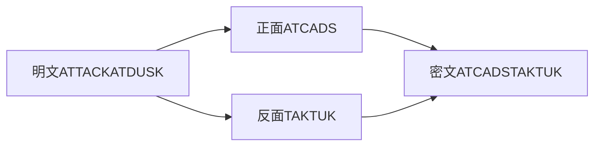
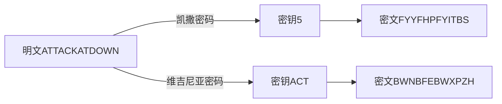

漫谈密码学，这是这个学期我研究性学习的主题。这次合作之路坎坎坷坷，中期报告和最后的结题报告分别因为活动和疫情取消了，但我也还是用心的写了几个有关加密的程序，最后的成绩也还不错。现在用这篇文章来做一个总结，也顺带再来“漫谈密码学”。

漫谈的内容主要有，密码学的定义与历史，艾伦·图灵，和三类加密方式。我也会展示我写的四个程序，讲一讲当时的思路。

<!--more-->

## 1. 密码学的定义与起源

### 1.1 什么是密码学？

密码学是一门科学，即研究编制密码和破译密码的技术科学，在实际应用方面又可分为编码学和破译学，分别负责编制密码和破译密码，统称就是密码学，英文名`Cryptography`。

**当然有一个极其的易错点，在于这里说的密码指的是加密后的字符串而不是我们平时生活中的Password。**

### 1.2 最早的密码学

世界上最早的密码起源于古希腊的斯巴达。斯巴达人在战时传递秘密消息的方法是：把要传递的信息——称为明文——一列一列地写到纸条上，每列两个字母，然后卷到一根木棍上，就可以阅读加密后的信息——称为密文。给个例子：



在此之后，又出现了凯撒密码和维吉尼亚密码，这一类密码最大的特点是使用另一个字符来替换原字符，方法分别是：



不过似乎上面几种加密方式还是太简单，我们来看一看密码学在历史上的辉煌时刻。

## 2. 二战时期的密码学

### 2.1 恩尼格码机

故事发生在二战时期，打仗的时候，每天都有大量的信息需要传递，而且必须经过加密。如果当时的军方使用刚刚我们讲到的三种加密方式的话，那他们的军事机密几乎可以被立刻破解，都算不上是机密了。原因在于一个（或一段）相同的明文字母对应一个（或一段）固定的密文字符，这样明文就可以通过暴力的手段破解出来。于是当时德国就发明所谓“复式替换密码”和对应的机器“恩格尼码机”`ENIGMA`。

`ENIGMA`这台机器，就像一台打字机。上面一共有26个键，键盘排列和广为使用的计算机键盘基本一样，只不过只有字母键，数字用单词代替。键盘上方就是显示器，就是标示了同样字母的26个小灯泡，当键盘上的某个键被按下时，和这个字母被加密后的密文字母所对应的小灯泡就会亮起来。

看起来很简单对不对？重点在于，这个加密的过程不同寻常。加密的工具是在显示器的上方三个直径6厘米的转子，每按下一个键，转子就会转一下，使同一个字母对应的密文往后一个字母。但是如果连续键入26个字母，转子就会整整转一圈，出现重复。于是`ENIGMA`又增加了两个转子，当第一个转子转动整整一圈以后，它上面有一个齿轮拨动第二个转子，使得它的方向转动一个字母的位置。所以要在26x26x26=17576个字母之后才会出现重复。

具体来说，就是：当第一次键入A，灯泡B亮，转子转动一格，各字母所对应的密码就改变了。第二次再键入A时，它所对应的字母就可能变成了C；同样地，第三次键入A时，又可能是灯泡D亮了。这就是“恩尼格玛”难以被破译的关键所在，这不是一种简单替换密码。同一个字母在明文的不同位置时，可以被不同的字母替换，而密文中不同位置的同一个字母，又可以代表明文中的不同字母，暴力破解在这里毫无用武之地！这种加密方式在密码学上被称为“复式替换密码”。

但这还没完。使用`ENIGMA`通讯时，发信人首先要调节三个转子的方向——而这个转子的初始方向就是密匙，是收发双方必须预先约定好的——然后依次键入明文，并把显示器上灯泡闪亮的字母依次记下来，最后把记录下的闪亮字母按照顺序用正常的电报方式发送出去。收信方收到电文后，只要也使用一台`ENIGMA`，按照原来的约定，把转子的方向调整到和发信方相同的初始方向上，然后依次键入收到的密文，显示器上自动闪亮的字母就是明文了。加密和解密的过程完全一样。

> 如果你没看懂上面的文字的话，可以看一下这个视频，还涉及到刚刚没讲的一些部分（比较慢，请稍等）：
> 
> <video src="../../../../videos/ENIGMA.mp4" controls="controls" />

### 2.2 炸弹机

既然有人拿`ENIGMA`发信收信，那就肯定有人破译解码。有这么一个伟人，成功破译了`ENIGMA`，他就是艾伦·图灵。他发明了一台机器，叫做“炸弹”。这台机器重1吨，装在一个7英尺宽，6.6英尺高，2英尺深的金属柜中。这台机器是用来破译当天`ENIGMA`的密钥的，具体思路也很简单：既然你是复式替换密码，那我也用转子来模拟，还是可以暴力破解！只要我的数量足够多，时间就可以减少。

在炸弹机上有`3x3x12`个转子，分成三组，分别模拟`ENIGMA`的右、中、左转子。模拟完之后，让机器自检，如果发现矛盾，那么当前模拟的这组密钥就是错误的。当发现一组合适的密钥之后，工作人员就会记录下这一组密钥，来尝试破解对方的军事情报。但是这样工作量似乎太大了，图灵就想到两个简化的方法：

1. **获取小抄**。根据图灵等人的发现，在截取的小抄中一定有“天气预报”和“万岁”等词，他们可以通过这些词是否出现来判断这种编码是否正确。

2. **利用`ENIGMA`的加密特性**。在`ENIGMA`中一个字母不会被加密成自身，故通过这种方法也能排除错误的秘钥。

最终，图灵破解了`ENIGMA`，不过由于工作的保密性，直到30年后人们才知道他的工作是有多么伟大。

> 想要知道具体是怎么判断当前模拟的密钥是否合适，可以看一下：
> 
> <video src="../../../../videos/Bomb.mp4" controls="controls" />

****

## 3. 三类加密方式

介绍了密码学的历史，我们现在来看一下现在常用的加密方式分成几类，以及对应的原理。他们是：对称加密、摘要算法和非对称加密。

### 3.1 对称式加密

假设，有两个人，一个叫做Bob，一个叫做Alice。这一天Bob想要给Alice邮寄一点东西，但因为比较贵重，他不放心这个邮政公司，怎么办呢？这里就直接揭晓答案：上锁。但是就像加密一样，上锁也是一门学问。然后Bob灵机一动，说我去买一把锁，配两把钥匙，一把我自己留着，一把我给Alice，每次邮寄东西的时候，只需要我上锁，她解锁就可以了。于是Bob就这么干了，Alice也成功的收到了东西。

这就是最基础的加密方式——对称式加密。整个过程中两个人使用的是相同的密钥，引申到信息技术上来说，就是：我们对一个字符串用一个密钥进行加密，发给对方，再让对方进行解密，即可。

> 这里引申一下，有一个情景：假设，还是那两个人，一个叫做Bob，一个叫做Alice。这一天Bob想要给Alice邮寄一点东西，还是采用上锁的方式。但这次Bob只配了一把钥匙，自己留着，没有给Alice。请问这个时候，Bob和Alice怎么安全的交换物品？
> 
> 答案是，Alice自己再去买一把锁，配一把钥匙。Bob先用自己的锁把东西锁起来，由于只有他自己有钥匙，所以没人能打开。等Alice收到了东西之后，她用自己配的锁再给东西锁起来，寄回Bob。Bob收到之后，用自己的钥匙把东西解开。然后这个时候东西上还有一把Alice的锁，所以还是没人打的开。Alice收到之后用自己的钥匙打开自己的锁，东西就安全地送达了。

这里我提出两种方式来实现对称式加密。

#### 3.1.1 凯撒密码

```python
def caesar(input) -> str:
    output = ''
    for char in input:
        ascii = ord(char)
        encoded_raw = ascii + 48
        if encoded_raw > 127:
            encoded = encoded_raw - 127 + 31
        else:
            encoded = encoded_raw
        output = output + chr(encoded)
    return output

running = 1
message = input('Input message to encode/decode: ')
while running:
    if message != 'q':
        print('Encoded/Decoded: ' + caesar(message))
    else:
        running = 0
    message = input('Input message to encode/decode(q to quit): ')
```

`Python`里面有两个函数`ord()`和`chr()`，可以把一个`ASCII`字符转化为对应的十进制数字。这个时候我们知道默认情况下英文+数字+标点对应32~127，所以一半刚好是48。我们把一个字符串中的每一个字符分别转为`ASCII`码，加上48，就可以完成加密。但如果这个数字超过了127，就要-127+31让它回到32~127里来。

看一下运行的结果：

```
Input message to encode/decode: Hello, world!
Encoded/Decoded: x5<<?\PG?B<4Q
Input message to encode/decode(q to quit): x5<<?\PG?B<4Q
Encoded/Decoded: Hello, world!
Input message to encode/decode(q to quit): q
```

可以看到相同的字母总是被加密成相同的字符，所以这种方法并不安全。有没有办法让它变得更安全呢？请看第二种方法：

#### 3.1.2 基于异或的加密

先说一下异或的概念，万一你没有听说过：在二进制中，对两个只有一位的数进行异或操作，结果相异为一，相同为零，即：

$$
1\oplus1=0\oplus0=0 \qquad
1\oplus0=0\oplus1=1
$$

如果是多位的话，直接在对应的每一位上进行操作。比如：

$$
1110\oplus10110=11000
$$

但真正让我们可以利用异或的地方在于它有一个性质叫做自反，说是，

$$
a \oplus b \oplus b = a
$$

这个一算就可以得出来，因为

$$
b \oplus b = 0
$$

所以原式就是

$$
a \oplus 0 = a
$$

所以我们就可以让式中的`a`为明文，`b`为密钥，加密时用

$$
a \oplus b = c
$$

解密时直接

$$
c \oplus b = a
$$

为了让加密更安全，我决定每一次随机生成一个和`a`相同长度的密钥`b`，输出就是`cb`（把`c`和`b`连起来）。这样，即使输入相同，每次的输出都不一样——但这依旧是对称式加密——解密时，只要把`cb`对半切，并执行异或，就可以得到`a`。看一下我的代码：

```python
import random, numpy

def get_hex_string(input):
    output = ''
    ascii_list = numpy.fromstring(input, dtype=numpy.uint8)
    #print('Debug: ASCII List of ' + input + ' : ' + str(ascii_list))
    for num in ascii_list:
        hex_ascii = hex(num)
        #print('Debug: hex of ' + str(num) + ' : ' + str(hex_ascii))
        output += str(hex_ascii)[2:]
    #print('Debug: Rendered Input: ' + output)
    return output
```

这个函数是用来把字符串转为十六进制的`ASCII`字符串。

```python
def encode(input):
    input = str(input)
    bin_of_input = ''
    cipher = '0b'
    #print('Debug: Input: ' + input)
    bin_of_input = str(bin(int(get_hex_string(input),16))[2:])
    if len(bin_of_input) % 4 != 0:
        needed_num = 4 - (len(bin_of_input) % 4)
        for x in range(needed_num):
            bin_of_input = '0' + bin_of_input
    #print('Debug: bin string of input: ' + bin_of_input)
    bin_of_input = str(bin(int(get_hex_string(input),16))[2:])
    for x in range(len(bin_of_input)):
        new_bit = random.randint(0, 1)
        cipher = cipher + str(new_bit)
    #print('Debug: Cipher: ' + cipher)
    xor = str(bin(int(('0b' + str(bin_of_input)), 2) ^ int(cipher, 2)))
    #print('Debug: XOR: ' + xor)
    #print('Debug: based 10 for xor: ' + str(int(xor[2:], 2)))
    #print('Debug: based 10 for cipher: ' + str(int(cipher[2:], 2)))
    if len(str(int(xor[2:], 2))) > len(str(int(cipher[2:], 2))):
        needed_num = len(str(int(xor[2:], 2))) - len(str(int(cipher[2:], 2)))
        cipher_base_10 = '0' * needed_num + str(int(cipher[2:], 2))
        xor_base_10 = str(int(xor[2:],2))
        output = xor_base_10 + cipher_base_10
    elif len(str(int(cipher[2:], 2))) > len(str(int(xor[2:], 2))):
        needed_num = len(str(int(cipher[2:], 2))) - len(str(int(xor[2:], 2)))
        xor_base_10 = '0' * needed_num + str(int(xor[2:], 2))
        cipher_base_10 = str(int(cipher[2:],2))
        output = xor_base_10 + cipher_base_10
    else:
        xor_base_10 = str(int(xor[2:],2))
        cipher_base_10 = str(int(cipher[2:],2))
        output = xor_base_10 + cipher_base_10
    return output
```

首先我们把字符串全部转成二进制的字符`bin_of_input`，为了后面方便我们把这个字符串通过在头上补0的方式补成4的倍数。然后随机生成一个相同长度的密码`cipher`，异或就能得到结果`xor`。不过这里还是需要把`cipher`和`xor`的位数补齐，连接起来，就是输出。

对应的解密代码则是：

```python
def decode(input):
    input = str(input)
    #print('Debug: Input: ' + input)
    to_decode = bin(int(input[0:int(len(input) / 2)]))
    to_decode_base_10 = int(input[0:int(len(input) / 2)])
    cipher_base_10 = int(input[int(len(input) / 2):])
    cipher = bin(int(input[int(len(input) / 2):]))
    #print('Debug: To decode: ' + str(to_decode) + ' , that is ' + str(to_decode_base_10))
    #print('Debug: Cipher is: ' + str(cipher) + ' , that is ' + str(cipher_base_10))
    original_base_10 = to_decode_base_10 ^ cipher_base_10
    #print('Debug: Original data in base 10: ' + str(original_base_10))
    original_base_16 = str(hex(original_base_10))[2:]
    #print('Debug: Original data in base 16: ' + str(original_base_16))
    original_base_16_list = list(original_base_16)
    #print('Debug: Original data list in base 16: ' + str(original_base_16_list))
    decoded = ''
    for x in range(int(len(original_base_16) / 2)):
        #print('Debug: Now decoding in base 16: ' + original_base_16_list[2*x] + original_base_16_list[2*x+1])
        to_decode_hex = original_base_16_list[2*x] + original_base_16_list[2*x+1]
        char = chr(int(to_decode_hex,16))
        decoded += char
    #print('Debug: Original Data Decoded: ' + decoded)
    return decoded
```

先把输入切成两半，然后执行异或。然后我们就能得到16进制下的明文，每两个字符转为`ASCII`字符，连接起来就可以得到明文。

整体如下：

```python
import random, numpy

def get_hex_string(input):
    output = ''
    ascii_list = numpy.fromstring(input, dtype=numpy.uint8)
    #print('Debug: ASCII List of ' + input + ' : ' + str(ascii_list))
    for num in ascii_list:
        hex_ascii = hex(num)
        #print('Debug: hex of ' + str(num) + ' : ' + str(hex_ascii))
        output += str(hex_ascii)[2:]
    #print('Debug: Rendered Input: ' + output)
    return output

def encode(input):
    input = str(input)
    bin_of_input = ''
    cipher = '0b'
    #print('Debug: Input: ' + input)
    bin_of_input = str(bin(int(get_hex_string(input),16))[2:])
    if len(bin_of_input) % 4 != 0:
        needed_num = 4 - (len(bin_of_input) % 4)
        for x in range(needed_num):
            bin_of_input = '0' + bin_of_input
    #print('Debug: bin string of input: ' + bin_of_input)
    bin_of_input = str(bin(int(get_hex_string(input),16))[2:])
    for x in range(len(bin_of_input)):
        new_bit = random.randint(0, 1)
        cipher = cipher + str(new_bit)
    #print('Debug: Cipher: ' + cipher)
    xor = str(bin(int(('0b' + str(bin_of_input)), 2) ^ int(cipher, 2)))
    #print('Debug: XOR: ' + xor)
    #print('Debug: based 10 for xor: ' + str(int(xor[2:], 2)))
    #print('Debug: based 10 for cipher: ' + str(int(cipher[2:], 2)))
    if len(str(int(xor[2:], 2))) > len(str(int(cipher[2:], 2))):
        needed_num = len(str(int(xor[2:], 2))) - len(str(int(cipher[2:], 2)))
        cipher_base_10 = '0' * needed_num + str(int(cipher[2:], 2))
        xor_base_10 = str(int(xor[2:],2))
        output = xor_base_10 + cipher_base_10
    elif len(str(int(cipher[2:], 2))) > len(str(int(xor[2:], 2))):
        needed_num = len(str(int(cipher[2:], 2))) - len(str(int(xor[2:], 2)))
        xor_base_10 = '0' * needed_num + str(int(xor[2:], 2))
        cipher_base_10 = str(int(cipher[2:],2))
        output = xor_base_10 + cipher_base_10
    else:
        xor_base_10 = str(int(xor[2:],2))
        cipher_base_10 = str(int(cipher[2:],2))
        output = xor_base_10 + cipher_base_10
    return output

def decode(input):
    input = str(input)
    #print('Debug: Input: ' + input)
    to_decode = bin(int(input[0:int(len(input) / 2)]))
    to_decode_base_10 = int(input[0:int(len(input) / 2)])
    cipher_base_10 = int(input[int(len(input) / 2):])
    cipher = bin(int(input[int(len(input) / 2):]))
    #print('Debug: To decode: ' + str(to_decode) + ' , that is ' + str(to_decode_base_10))
    #print('Debug: Cipher is: ' + str(cipher) + ' , that is ' + str(cipher_base_10))
    original_base_10 = to_decode_base_10 ^ cipher_base_10
    #print('Debug: Original data in base 10: ' + str(original_base_10))
    original_base_16 = str(hex(original_base_10))[2:]
    #print('Debug: Original data in base 16: ' + str(original_base_16))
    original_base_16_list = list(original_base_16)
    #print('Debug: Original data list in base 16: ' + str(original_base_16_list))
    decoded = ''
    for x in range(int(len(original_base_16) / 2)):
        #print('Debug: Now decoding in base 16: ' + original_base_16_list[2*x] + original_base_16_list[2*x+1])
        to_decode_hex = original_base_16_list[2*x] + original_base_16_list[2*x+1]
        char = chr(int(to_decode_hex,16))
        decoded += char
    #print('Debug: Original Data Decoded: ' + decoded)
    return decoded

def main(message, mode) -> str:
    output = ''
    if mode == 'e':
        output = encode(message)
    elif mode == 'd':
        output = decode(message)
    else:
        output = 'Incorrect Mode.'
    return output

running = 1
message = input('Input message to encode/decode: ')
mode = input('Input mode(e for encode, d for decode): ')
print('Encoded/Decoded: ' + str(main(message, mode)))
while running:
    message = input('Input message to encode/decode(q to quit): ')
    if message != 'q':
        mode = input('Input mode(e for encode, d for decode): ')
        print('Encoded/Decoded: ' + str(main(message, mode)))
    else:
        running = 0
```

我们运行的结果如下（每次随机）：

```
Input message to encode/decode: Hello, world!
Input mode(e for encode, d for decode): e
Encoded/Decoded: 53209648505988079748665083464600895527037738336522882135887997
Input message to encode/decode(q to quit): 53209648505988079748665083464600895527037738336522882135887997
Input mode(e for encode, d for decode): d
Encoded/Decoded: Hello, world!
Input message to encode/decode(q to quit): Hello, world!
Input mode(e for encode, d for decode): e
Encoded/Decoded: 29388696101925044891870915946658671329447137396761480970557832
Input message to encode/decode(q to quit): 29388696101925044891870915946658671329447137396761480970557832
Input mode(e for encode, d for decode): d
Encoded/Decoded: Hello, world!
Input message to encode/decode(q to quit): q
```

### 3.2 摘要算法`Hash`

但其实对称式加密也不是特别安全，万一你的密钥被第三个人发现了怎么办？信息一样会泄露，甚至会被篡改。这里，我们就可以通过一个叫做单向加密，或者摘要的方式来判断解密出的明文是否与源文件一致。摘要算法英文名叫做`hash`，也就是大家可能听说过的哈希。

意思是说，对于长度不同的字符串，通过某种算法可以得到一个固定长度的哈希值。这个加密函数够复杂，使一般的计算机没有办法在短时间内从这个哈希值解密为明文。此外就是，哈希值一定会碰撞，这个也好理解，在同一函数下可能得到的固定长的结果无论有多少种，它的数量一定是有限的；然而我们却要用它们表示世界上无穷多的字符串，故一定会出现不同的字符串对应相同的哈希值的情况，这给破译哈希值带来了更大的困难。

要检验文件是否完整且正确，只需让发布文件的人先运行算法得到哈希值，然后他会把这个哈希值放在网上，你下载文件之后自己再对这个文件进行计算，并比对哈希值即可。

比如我现在有这么一个文件1.txt，里面写着一大串根本没有规律的字符；我还有两个文本文件2.txt和3.txt，怎么在不暴力比对的情况下，判断哪个文件和1.txt内容完全相同呢？我们只需要先计算出它们的哈希值（这里我使用了MD5算法）然后比较就可以了。既然1.txt是我们的源文件，那么我们就先获取到它的哈希值，看一下是这个。然后我们再分别判断2.txt和3.txt的哈希值是否与这个相同即可。（由于文件内容太过于杂乱无章，我也就不放上来了）我还写了一个程序，来辅助这个过程：

```python
from tkinter import *
import tkinter.filedialog
import hashlib, time
root = Tk()

def encode():
    try:
        with open(tkinter.filedialog.askopenfilename(), mode='r', encoding='utf-8') as f:
            #print(f.read())
            btn1.config(text="You selected: " + f.name + " .")
            root.update()
            time.sleep(1)
            str = f.read().encode('utf-8')
            strhash = hashlib.md5(str)
            md5 = strhash.hexdigest()
            print("MD5: "+md5)
    except UnicodeDecodeError:
        btn1.config(text="Binary file not supported!")
        root.update()
        time.sleep(3)
    finally:
        btn1.config(text="Encode File(Select File...)")
        root.update()


def decode():
    try:
        with open(tkinter.filedialog.askopenfilename(), mode='r', encoding='utf-8') as f:
            #print(f.read())
            btn2.config(text="You selected: " + f.name + " .")
            root.update()
            generatedMD5 = input("Input MD5 for the file: ")
            str = f.read().encode('utf-8')
            strhash = hashlib.md5(str)
            md5 = strhash.hexdigest()
            if generatedMD5 == md5:
                print("The file is original.")
            else:
                print("You inputed "+ generatedMD5 + ", while the correct one is "+ md5 +" , this file has been edited.")
    except UnicodeDecodeError:
        btn2.config(text="Binary file not supported!")
        root.update()
        time.sleep(3)
    finally:
        btn2.config(text="Decode File(Select File...)")
        root.update()

btn1 = Button(root, text="Encode File(Select File...)",command=encode)
btn2 = Button(root, text="Decode File(Select File...)",command=decode)
btn1.pack()
btn2.pack()
root.mainloop()
```

比较遗憾的是这个程序只支持文本文件（且一定要是`UTF-8`编码）。运行示例如下（有图形界面，不截图了）：

```
MD5: 25b44732f5b63525694a69f19ef198f3
Input MD5 for the file: 25b44732f5b63525694a69f19ef198f3
You inputed 25b44732f5b63525694a69f19ef198f3, while the correct one is a35f8d86a6ee17d96162c9a86d2d4362 , this file has been edited.
Input MD5 for the file: 25b44732f5b63525694a69f19ef198f3
The file is original.
```

对称式加密和摘要算法不仅仅停留在理论中，它们在实际生活中也在发光发热。我们每天上网，与服务器的主机建立连接、发送、接收信息，都会经过加密、解密、校验这三个步骤（专业一点，`SSL`）。当你在地址栏中的链接旁边看到挂锁图标时，这意味着`SSL`保护你正在访问的网站。密码学这门学科是在无形之中保障我们的上网安全，是真正“做好事不留名”的“英雄”。

但是，只要对称式加密和摘要算法就够了吗？

### 3.3 非对称式加密

由于这个非对称式加密需要的数学功底太高深，我自己也没有写出来程序，这里就大致介绍一下原理。与对称加密算法不同，非对称加密算法需要两个密钥：公开密钥和私有密钥。公开密钥与私有密钥是一对，如果用公开密钥对数据进行加密，只有用对应的私有密钥才能解密；如果用私有密钥对数据进行加密，那么只有用对应的公开密钥才能解密。因为加密和解密使用的是两个不同的密钥，所以这种算法叫作非对称加密算法。使用时，加密密钥(公钥)向公众公开，谁都可以使用，解密密钥(秘钥)只有解密人自己知道，非法使用者根据公开的加密密钥无法推算出解密密钥。这样就能够保证（1）只有我能看到别人给我发的信息（2）别人知道消息是我发的。

此外，非对称式加密可以用于数字签名。甲方使用自己的私有密钥对信息进行加密后再发送给乙方；乙方使用甲方提供的公开密钥对加密后的信息进行解密，如果成功解密即可证实信息确实是由甲方所发，并非他人冒充，这就是常用的数字签名技术。

常见的应用有`Git`，在配置时生成的就是非对称的一对公钥、密钥。

****

## 4. 延伸——艾伦·图灵与图灵机

前文提到了艾伦·图灵发明炸弹机，但这并不是图灵最大的成就。他最大的成就是另一台机器，以他的名字命名——图灵机。

图灵机，指一个抽象的机器，是图灵于1936年提出的一种抽象的计算模型，即将人们使用纸笔进行数学运算的过程进行抽象，由一个虚拟的机器替代人类进行数学运算。它有一条无限长的纸带，纸带分成了一个一个的小方格，每个方格有不同的颜色。有一个机器头在纸带上移来移去。机器头有一组内部状态，还有一些固定的程序。在每个时刻，机器头都要从当前纸带上读入一个方格信息，然后结合自己的内部状态查找程序表，根据程序输出信息到纸带方格上，并转换自己的内部状态，然后进行移动。

图灵的基本思想是用机器来模拟人们用纸笔进行数学运算的过程，他把这样的过程看作下列两种简单的动作：

1. 在纸上写上或擦除某个符号;

2. 把注意力从纸的一个位置移动到另一个位置。

而在每个阶段，人要决定下一步的动作，依赖于(1)此人当前所关注的纸上某个位置的符号和(2)此人当前思维的状态。为了模拟人的这种运算过程，图灵构造出一台假想的机器，该机器由以下几个部分组成:

1. 一条无限长的纸带TAPE。纸带被划分为一个接一个的小格子，每个格子上包含一个来自有限字母表的符号，字母表中有一个特殊的符号表示空白。纸带上的格子从左到右依此被编号为0，1，2，..纸带的右端可以无限伸展。

2. 一个读写头HEAD。该读写头可以在纸带上左右移动，它能读出当前所指的格子上的符号，并能改变当前格子上的符号。

3. 一套控制规则TABLE。它根据当前机器所处的状态以及当前读写头所指的格子上的符号来确定读写头下一步的动作，并改变状态寄存器的值，令机器进入一个新的状态。

4. 一个状态寄存器。它用来保存图灵机当前所处的状态。图灵机的所有可能状态的数目是有限的，并且有一个特殊的状态，称为停机状态。这里也引申出来一个停机问题。

注意这个机器的每一部分都是有限的，但它有一个潜在的无限长的纸带，因此这种机器只是一个理想的设备。图灵认为这样的一台机器就能模拟人类所能进行的任何计算过程。图灵机证明了通用计算理论，肯定了计算机实现的可能性，同时它给出了计算机应有的主要架构，引入了读写与算法与程序语言的概念，极大的突破了过去的计算机器的设计理念。

最后再来看一个视频，了解一下停机问题。

> <video src="../../../../videos/HaltProblem.mp4" controls="controls" />

***

虽然我没能把准备的所有内容都讲给我的同学听，但还是很高兴做了这次复盘，也算是能够了了自己一个心愿。

**THE END**感谢您的阅读~
